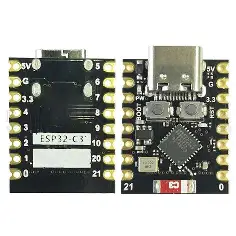

# ESP32-C3 多功能控制平台

基于 MicroPython 的 ESP32-C3 设备固件，集成 Wi-Fi AP/STA、UDP 通信、自组织邻居发现、动态路由、舵机控制、红外遥控（IR05T）、LED 指示及 Web 管理界面。适用于物联网原型、智能家居、机器人控制等场景。

---

## 目录
- [简介](#简介)
- [核心能力](#核心能力)
- [硬件要求](#硬件要求)
- [软件依赖](#软件依赖)
- [快速开始](#快速开始)
  - [烧录固件](#烧录固件)
  - [首次启动与配置](#首次启动与配置)
  - [连接设备](#连接设备)
- [配置与使用](#配置与使用)
  - [Web 管理界面](#web-管理界面)
  - [UDP 命令协议](#udp-命令协议)
  - [邻居发现与路由](#邻居发现与路由)
- [硬件扩展指南](#硬件扩展指南)
  - [添加舵机](#添加舵机)
  - [添加红外设备](#添加红外设备)
  - [自定义命令模块](#自定义命令模块)
- [常见问题](#常见问题)
- [开发与贡献](#开发与贡献)
- [许可证](#许可证)

---

## 简介

本项目为 ESP32-C3 提供了一套完整的嵌入式控制固件，采用 MicroPython 编写，旨在简化设备间的通信与控制。核心特性包括：

- **双 Wi-Fi 模式**：同时运行 AP（接入点）和 STA（客户端）模式，便于配置和接入现有网络。
- **UDP 命令系统**：通过 UDP 广播/单播发送结构化命令，实现远程控制、状态查询和配置修改。
- **自组织网络**：设备自动发现邻居（通过 MAC 地址和 IP），维护邻居表；并通过路由表实现多跳消息转发。
- **硬件驱动**：内置 LED、舵机（PWM）、红外收发（IR05T）驱动，支持动态引脚分配。
- **Web 控制台**：提供友好的 Web 界面，实时查看状态、发送命令、管理邻居/路由表。
- **持久化配置**：所有配置（Wi-Fi、AP、昵称、邻居、路由等）保存在 JSON 文件中，重启不丢失。

---

## 核心能力

| 功能模块 | 说明 |
|----------|------|
| **网络管理** | 自动启动 AP（SSID 为 `ESP32-C3-Setup-XXXXX`），支持 STA 连接指定 WiFi。 |
| **UDP 通信** | 监听 8888 端口（可配置），支持分片传输长消息，自动重组。 |
| **命令解析** | 支持内置命令（`help`、`status`、`memory`）及模块化命令（`ap,set_ssid,xxx`）。 |
| **邻居发现** | 通过周期性广播“邻居请求回复”消息，交换设备昵称，维护邻居表（TTL 自动过期）。 |
| **路由转发** | 维护路由表（距离矢量），支持多跳消息转发，实现跨网段通信。 |
| **LED 指示** | 可配置 GPIO 引脚，支持常亮、闪烁、呼吸灯效果，Wi-Fi 连接后常亮。 |
| **舵机控制** | 支持多个舵机（SG90 等），可设置引脚、初始角度，录制/播放动作组。 |
| **红外遥控** | 驱动 IR05T 模块，支持学习原始红外码、保存到命名数据、发射。 |
| **重置功能** | 可通过指定 GPIO 短接指定秒数触发恢复出厂设置（删除所有配置文件）。 |
| **Web API** | 提供 RESTful API（`/api/*`），涵盖状态查询、配置修改、UDP 发送等。 |

---

## 硬件要求

- **主控**：ESP32-C3 系列开发板（如 ESP32-C3-DevKitM-1、SuperMini 等）
- **板载 LED**：默认 GPIO8（低电平点亮），可根据板型调整。
- **舵机**：任意 PWM 舵机，信号线接任意空闲 GPIO（建议 3.3V 兼容）。
- **红外模块**：IR05T（串口通信），接 TX/RX GPIO（默认 UART1）。
- **重置引脚**：默认 GPIO10，低电平触发，保持时间可配置（默认 8 秒）。
- **电源**：USB 5V 或 3.3V 供电（根据板载稳压）。

> **注意**：ESP32-C3 的 GPIO12~17 通常用于 Flash，请避免使用。

---

## 软件依赖

- **MicroPython 固件**：适用于 ESP32-C3 的官方固件（≥ v1.20）。
- **Python 环境**：用于烧录和串口调试（`esptool.py`、`rshell` 或 `ampy` 可选）。
- **浏览器**：任何现代浏览器（访问 Web 界面）。

---

## 快速开始

### 1. 烧录 MicroPython 固件
1. 下载 ESP32-C3 的 MicroPython 固件（`.bin`）[官方下载](https://micropython.org/download/ESP32_GENERIC_C3/)。
2. 使用 `esptool.py` 擦除并烧录：
   ```bash
   esptool.py --chip esp32c3 --port /dev/ttyUSB0 erase_flash
   esptool.py --chip esp32c3 --port /dev/ttyUSB0 --baud 460800 write_flash -z 0x0 firmware.bin

3. 使用 rshell 或 ampy 将本项目所有 .py 文件上传到设备文件系统根目录（/）。
   · 必须上传的文件：app.py, main.py, boot.py, config.py, constants.py, util.py, wifi.py, udp.py, udp_sender.py, udp_handlers.py, fragment_protocol.py, neighbor.py, route.py, loader.py, led.py, servo_control.py, servo_commands.py, ir05t.py, ir_commands.py, 以及各个 *_commands.py。
   · 若有 web/ 目录（包含 webui.html 等），一并上传。
4. 复位设备，等待 AP 热点出现（默认 SSID 类似 ESP32-C3-Setup-XXXXX，无密码）。

2. 首次启动与配置

· 连接设备 AP 热点（Wi-Fi 密码为空）。
· 在浏览器访问 http://192.168.4.1（默认 AP IP），进入 Web 控制台。
· 页面加载后，点击顶部“连接”按钮（默认 IP 已填），状态变为“已连接”。
· 进行必要配置：
  · STA 设置：输入家庭/实验室 Wi-Fi SSID 和密码，保存后设备会自动连接（LED 常亮表示成功）。
  · AP 设置：可修改 AP SSID、密码、IP 网段等。
  · 昵称：为设备设置一个易识别的昵称（用于邻居发现）。
  · UDP 端口：可更改接收/发送端口（需重启）。

3. 连接设备

· 通过 AP 热点：设备未连接 STA 时，仍可通过 AP 热点访问 Web 和 UDP 命令。
· 通过 STA 网络：设备连接 STA 后，会同时获得 AP 和 STA 两个 IP，均可访问。
· UDP 命令测试：使用 netcat 或 Python 脚本发送命令到设备 UDP 端口（默认 8888）：
  ```bash
  echo "hello" | nc -u 192.168.4.1 8888
  ```
  设备会回复 Hi <dst_mac>. I am <nickname>。

---

配置与使用

Web 管理界面

Web 界面提供以下功能（通过顶部导航切换）：

· 主页：显示系统状态（AP/STA 信息、LED 引脚、内存、MAC 等），可扫描连接设备、查看昵称。
· 广播：发送 UDP 广播（可分别针对 AP、STA 或双网段），查看收到的 UDP 消息。
· 单播：向指定 IP 尾号（AP/STA 网段）、完整 IP 或设备昵称发送 UDP 消息；也可发送路由消息（指定目标 MAC）。
· 邻居表：查看已发现的邻居设备（MAC、IP、TTL），设置邻居广播间隔，管理昵称。
· 路由表：查看多跳路由表（含跃距、源 MAC），设置路由通告间隔，删除路由。
· AP 设置：修改 AP SSID/密码、网段，重置 AP 配置。
· STA 设置：修改 STA SSID/密码、连接超时。
· UDP 设置：修改接收/目标端口、消息轮询间隔。
· 系统设置：修改本机昵称、LED 引脚、重置引脚配置，重启设备。

UDP 命令协议

设备支持通过 UDP 发送结构化命令（格式：模块,子命令,参数1,参数2,...），回复同样通过 UDP 返回（默认目标端口 8888）。

内置命令（无需模块前缀）：

· hello / hi：回复问候语。
· help：显示所有可用命令（需配置文件支持）。
· status：显示当前网络、邻居、路由等状态。
· memory：显示内存使用情况。

模块命令示例：

模块 子命令 参数 说明
ap set_ssid <新SSID> 修改 AP SSID（需重启）
ap set_password <新密码> 修改 AP 密码（需重启）
ap set_ip <IP> 修改 AP IP（需重启）
sta set_ssid <新SSID> 修改 STA SSID（需重启）
sta set_password <新密码> 修改 STA 密码（需重启）
nickname set <新昵称> 修改本机昵称（立即生效）
neighbor list - 显示邻居表
neighbor set_interval <秒数> 设置邻居广播间隔
route list - 显示路由表
route set_interval <秒数> 设置路由通告间隔
reset set_pin <引脚号> 设置重置引脚（需重启）
reset set_time <秒数> 设置重置保持时间
servo set_pin <舵机名>,<引脚> 创建舵机并分配引脚
servo set <舵机名>,<角度> 立即转动舵机
servo record <舵机名>,<动作组名>,<角度1>,<角度2>,... 录制动作组
servo play <舵机名>,<动作组名> 播放动作组（异步）
ir05t add <设备名>,<TX引脚>,<RX引脚> 添加红外设备
ir05t learn_save <设备名>,<数据名> 学习并保存红外码
ir05t send <设备名>,<数据名> 发射已保存的红外码

所有命令均支持 help 子命令（如 ap,help）查看详细用法。

邻居发现与路由

· 邻居发现：设备每隔 g_neighbor_advertise_interval（默认 20 秒）在 AP 和 STA 网段广播“邻居请求回复”消息，携带本机昵称。收到回复的设备将其加入邻居表（TTL=2，每周期减 1，归零则移除）。
· 路由表：设备每隔 g_route_advertise_interval（默认 90 秒）在 STA 网段广播“路由通告”，包含自身可达的设备列表（MAC、距离、昵称、来源）。收到通告的设备更新路由表（距离+1），并保存昵称。
· 消息转发：当发送方指定目标 MAC 且本机不是目标时，设备会查询邻居表或路由表，将消息转发给下一跳，实现多跳通信。

---

硬件扩展指南

添加舵机

1. 在 Web 界面中，进入“AP设置”或“系统设置”无关，直接使用 UDP 命令或 Web API 添加：
   · 命令：servo,set_pin,my_servo,GPIO14
   · 配置将保存在 servo-config.json 中。
2. 设置初始角度：servo,set_init_angle,my_servo,90
3. 控制：servo,set,my_servo,45
4. 录制动作组：servo,record,my_servo,wave,0,45,90,45,0
5. 播放：servo,play,my_servo,wave

也可通过 Web API 调用 /api/...（具体见 web_routes.py 中的路由）。

添加红外设备

1. 连接 IR05T 模块的 TX/RX 到 ESP32-C3 的任意 GPIO（注意电压匹配）。
2. 使用命令添加设备：ir05t,add,remote,GPIO4,GPIO5（TX 引脚=4，RX 引脚=5）。
3. 学习红外码：ir05t,learn_save,remote,power（按遥控器对应按键）。
4. 发射：ir05t,send,remote,power。

自定义命令模块

如需添加新的命令模块（例如控制继电器），请遵循以下步骤：

1. 创建命令处理文件，例如 relay_commands.py，实现处理函数：
   ```python
   # relay_commands.py
   def handle_relay_command(parts):
       if len(parts) < 2:
           return "错误: 缺少子命令"
       subcmd = parts[1].lower()
       if subcmd == "on":
           # 控制继电器打开
           return "继电器已打开"
       elif subcmd == "off":
           return "继电器已关闭"
       else:
           return f"未知子命令: {subcmd}"
   ```
2. 注册到命令分发器：在 udp_handlers.py 的 custom_udp_processing 函数中添加：
   ```python
   elif module == "relay":
       from relay_commands import handle_relay_command
       response = handle_relay_command(parts)
       send_response(response, sender_ip, dst_mac, direct_transmission)
   ```
3. （可选）添加 Web 界面：在 webui.html 中新增页面或按钮，调用对应的 API。
4. 重启设备或执行 config,reload 使新模块生效。

---

常见问题

Q：上电后无法看到 AP 热点？
A：确保设备已正确烧录固件并上传所有 Python 文件。检查串口日志（通过 screen /dev/ttyUSB0 115200）查看启动信息。

Q：Web 界面无法加载或卡死？
A：可能原因：

· 设备内存不足，尝试重启并减少同时打开的功能。
· 浏览器跨域问题，确保访问的 IP 与设备 IP 一致。
· 检查设备是否处于 AP 模式且 IP 为 192.168.4.1。

Q：UDP 命令无响应？
A：检查目标端口是否正确（默认 8888），确保发送方 IP 在设备同一子网。可先尝试 hello 命令测试连通性。

Q：如何恢复出厂设置？
A：方法 1：短接重置引脚（默认 GPIO10）保持 8 秒（可通过 reset,set_time 修改）。方法 2：通过 Web 界面“系统设置”中的“重置配置并重启”。方法 3：使用 UDP 命令 config,reset（会重启）。

Q：舵机抖动或不能转动？
A：检查电源是否足够（舵机需独立供电），PWM 频率应为 50Hz，占空比范围对应 0.5~2.5ms 脉冲。可调整 ServoController 的 min_duty/max_duty 参数。

Q：红外学习失败？
A：确保 IR05T 模块已正确接线，波特率匹配（默认 9600）。学习时需对准遥控器并按下按键，模块指示灯会闪烁。

Q：如何查看设备日志？
A：通过串口工具（如 Putty、screen）连接，波特率 115200，可看到详细调试信息。

---

开发与贡献

· 代码结构：所有功能模块按职责划分，核心网络和配置在 config.py、wifi.py、udp*.py，硬件驱动在 led.py、servo_control.py、ir05t.py，业务命令在 *_commands.py。
· 扩展建议：新增硬件支持时，遵循“驱动 + 命令处理 + Web API”三层结构，保持代码解耦。
· 贡献指南：欢迎提交 Issue 和 Pull Request，请确保代码风格一致（PEP8 可适度调整）并附带测试。

---

许可证

本项目采用 GNU General Public License v3.0 (GPLv3) 授权。

GPLv3 核心要求：

· 您可以自由使用、复制、修改和分发本软件。
· 如果您分发本软件或其衍生作品，必须以 GPLv3 许可证发布您的修改，并且必须提供完整的源代码（包括您所做的修改）。
· 您不得将 GPL 代码集成到闭源商业软件中，除非您的整个项目也遵循 GPLv3 开源。
· 本软件“按原样”提供，不提供任何形式的担保。详情请参见 LICENSE 文件。

建议：在您修改或扩展本固件时，请在每个源代码文件头部添加版权声明和 SPDX 标识符，例如：
# SPDX-License-Identifier: GPL-3.0-only
并保留原作者的版权声明。

---

祝您玩得开心！ 如有任何问题，请查看代码中的详细注释或提交 Issue。

```
## 许可证

本项目采用 **GNU General Public License v3.0 (GPLv3)** 授权。

**GPLv3 核心要求**：
- 您**可以**自由使用、复制、修改和分发本软件。
- 如果您分发本软件或其衍生作品，**必须**以 GPLv3 许可证发布您的修改，并且**必须**提供完整的源代码（包括您所做的修改）。
- 您**不得**将 GPL 代码集成到闭源商业软件中，除非您的整个项目也遵循 GPLv3 开源。
- 本软件“按原样”提供，不提供任何形式的担保。详情请参见 [GNU GPLv3 官方文本](https://www.gnu.org/licenses/gpl-3.0.html)。

> **建议**：在您修改或扩展本固件时，请在每个源代码文件头部添加版权声明和 SPDX 标识符，例如：
> `# SPDX-License-Identifier: GPL-3.0-only`
> 并保留原作者的版权声明。

